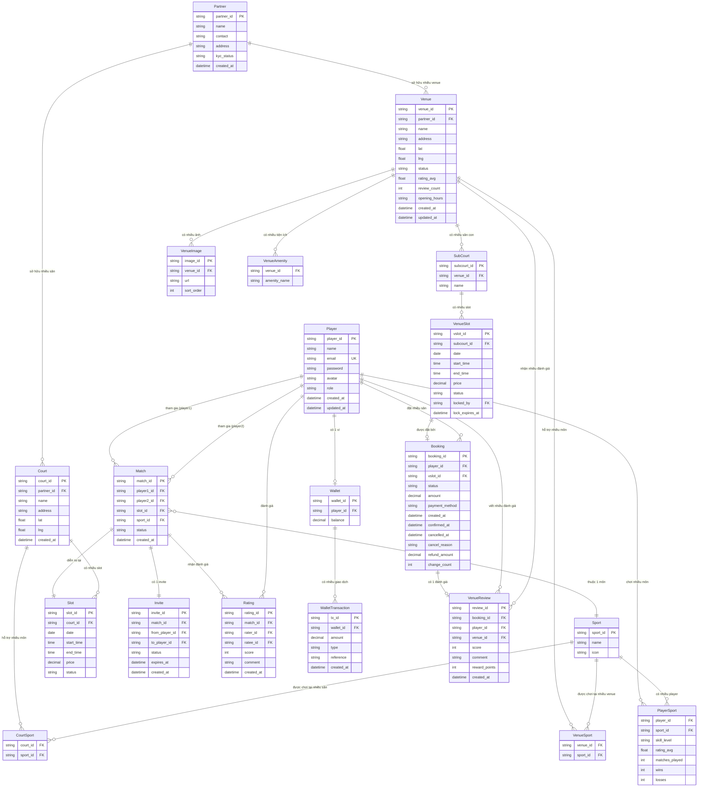

# Sport Matching — Entity Relationship Diagram

```mermaid
erDiagram
    Player {
        string player_id PK
        string name
        string email UK
        string password
        string avatar
        string role
        datetime created_at
        datetime updated_at
    }

    Sport {
        string sport_id PK
        string name
        string icon
    }

    PlayerSport {
        string player_id FK
        string sport_id FK
        string skill_level
        float rating_avg
        int matches_played
        int wins
        int losses
    }

    Partner {
        string partner_id PK
        string name
        string contact
        string address
        string kyc_status
        datetime created_at
    }

    Court {
        string court_id PK
        string partner_id FK
        string name
        string address
        float lat
        float lng
        datetime created_at
    }

    CourtSport {
        string court_id FK
        string sport_id FK
    }

    Slot {
        string slot_id PK
        string court_id FK
        date date
        time start_time
        time end_time
        decimal price
        string status
    }

    Match {
        string match_id PK
        string player1_id FK
        string player2_id FK
        string slot_id FK
        string sport_id FK
        string status
        datetime created_at
    }

    Invite {
        string invite_id PK
        string match_id FK
        string from_player_id FK
        string to_player_id FK
        string status
        datetime expires_at
        datetime created_at
    }

    Rating {
        string rating_id PK
        string match_id FK
        string rater_id FK
        string ratee_id FK
        int score
        string comment
        datetime created_at
    }

    Wallet {
        string wallet_id PK
        string player_id FK
        decimal balance
    }

    WalletTransaction {
        string tx_id PK
        string wallet_id FK
        decimal amount
        string type
        string reference
        datetime created_at
    }

    Venue {
        string venue_id PK
        string partner_id FK
        string name
        string address
        float lat
        float lng
        string status
        float rating_avg
        int review_count
        string opening_hours
        datetime created_at
        datetime updated_at
    }

    SubCourt {
        string subcourt_id PK
        string venue_id FK
        string name
    }

    VenueSport {
        string venue_id FK
        string sport_id FK
    }

    VenueImage {
        string image_id PK
        string venue_id FK
        string url
        int sort_order
    }

    VenueAmenity {
        string venue_id FK
        string amenity_name
    }

    VenueSlot {
        string vslot_id PK
        string subcourt_id FK
        date date
        time start_time
        time end_time
        decimal price
        string status
        string locked_by FK
        datetime lock_expires_at
    }

    Booking {
        string booking_id PK
        string player_id FK
        string vslot_id FK
        string status
        decimal amount
        string payment_method
        datetime created_at
        datetime confirmed_at
        datetime cancelled_at
        string cancel_reason
        decimal refund_amount
        int change_count
    }

    VenueReview {
        string review_id PK
        string booking_id FK
        string player_id FK
        string venue_id FK
        int score
        string comment
        int reward_points
        datetime created_at
    }

    Player ||--o{ PlayerSport : "chơi nhiều môn"
    Sport ||--o{ PlayerSport : "có nhiều player"
    Player ||--o{ Match : "tham gia (player1)"
    Player ||--o{ Match : "tham gia (player2)"
    Match ||--|| Slot : "diễn ra tại"
    Match ||--|| Invite : "có 1 invite"
    Match ||--o{ Rating : "nhận đánh giá"
    Player ||--o{ Rating : "đánh giá"
    Partner ||--o{ Court : "sở hữu nhiều sân"
    Court ||--o{ CourtSport : "hỗ trợ nhiều môn"
    Sport ||--o{ CourtSport : "được chơi tại nhiều sân"
    Court ||--o{ Slot : "có nhiều slot"
    Player ||--o| Wallet : "có 1 ví"
    Wallet ||--o{ WalletTransaction : "có nhiều giao dịch"
    Match }o--|| Sport : "thuộc 1 môn"
    Partner ||--o{ Venue : "sở hữu nhiều venue"
    Venue ||--o{ SubCourt : "có nhiều sân con"
    Venue ||--o{ VenueSport : "hỗ trợ nhiều môn"
    Sport ||--o{ VenueSport : "được chơi tại nhiều venue"
    Venue ||--o{ VenueImage : "có nhiều ảnh"
    Venue ||--o{ VenueAmenity : "có nhiều tiện ích"
    SubCourt ||--o{ VenueSlot : "có nhiều slot"
    VenueSlot ||--o| Booking : "được đặt bởi"
    Player ||--o{ Booking : "đặt nhiều sân"
    Booking ||--o| VenueReview : "có 1 đánh giá"
    Player ||--o{ VenueReview : "viết nhiều đánh giá"
    Venue ||--o{ VenueReview : "nhận nhiều đánh giá"
```
