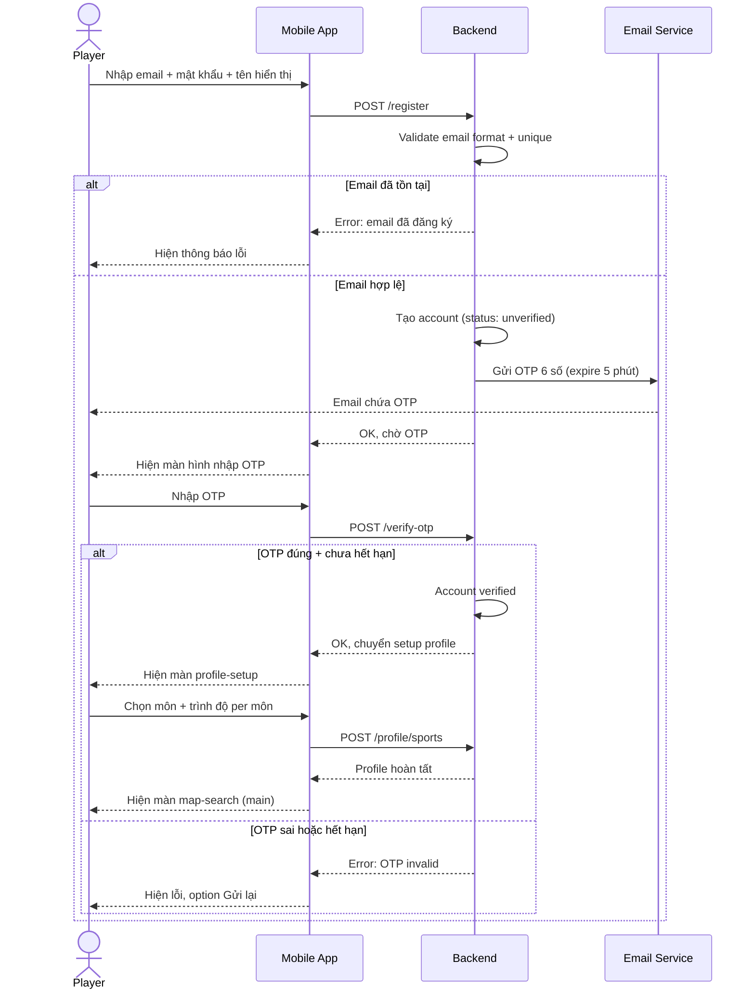
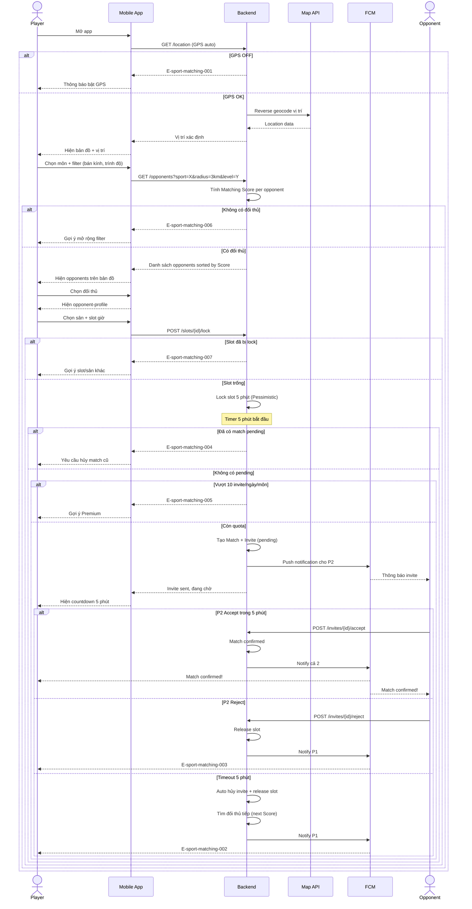
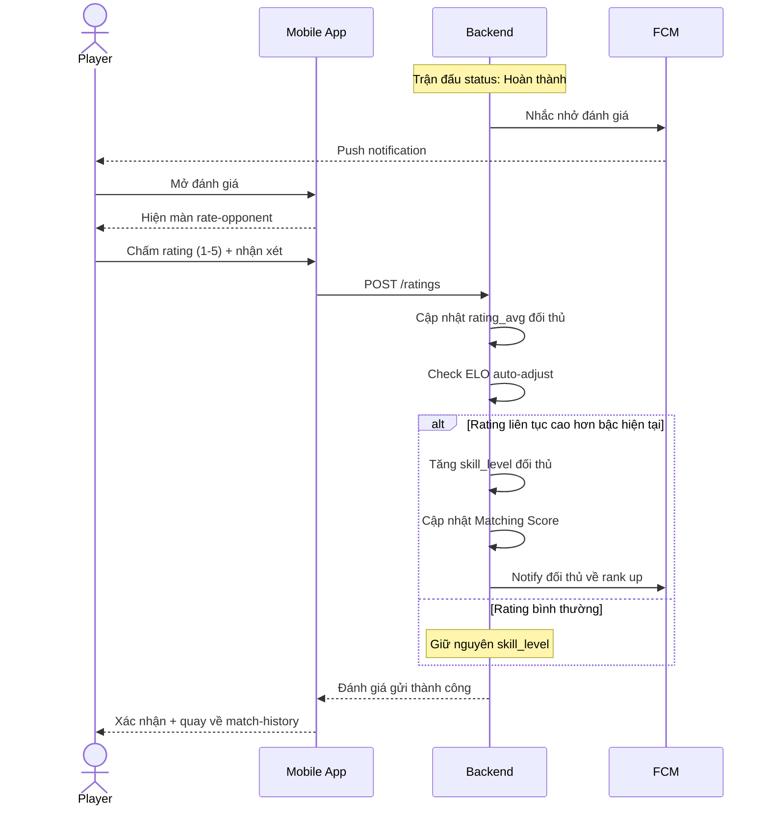

# Sport Matching — Sequence & Activity Diagrams

## Flow: Registration + OTP

- **Trigger:** Player mở app lần đầu, chọn Đăng ký
- **Related UC:** uc-register
- **Related FR:** FR-sport-matching-001, FR-sport-matching-002

## Flow: Matching + Booking + Invite

- **Trigger:** Player mở app, chọn môn, tìm đối thủ
- **Related UC:** uc-find-opponent, uc-book-match
- **Related FR:** FR-sport-matching-003 đến FR-sport-matching-010

## Flow: Rating + Auto-adjust

- **Trigger:** Trận đấu hoàn thành, system gửi nhắc nhở
- **Related UC:** uc-rate-opponent
- **Related FR:** FR-sport-matching-011, FR-sport-matching-014

