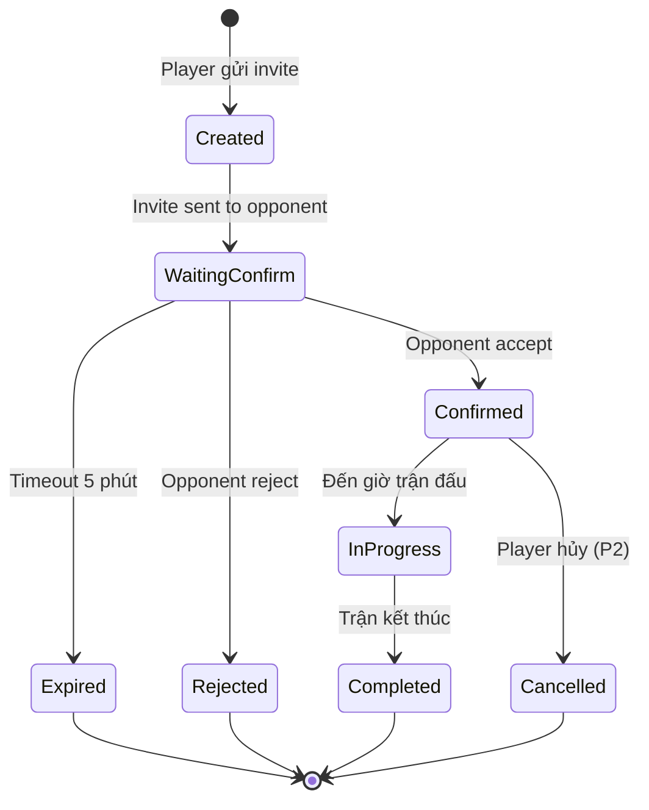
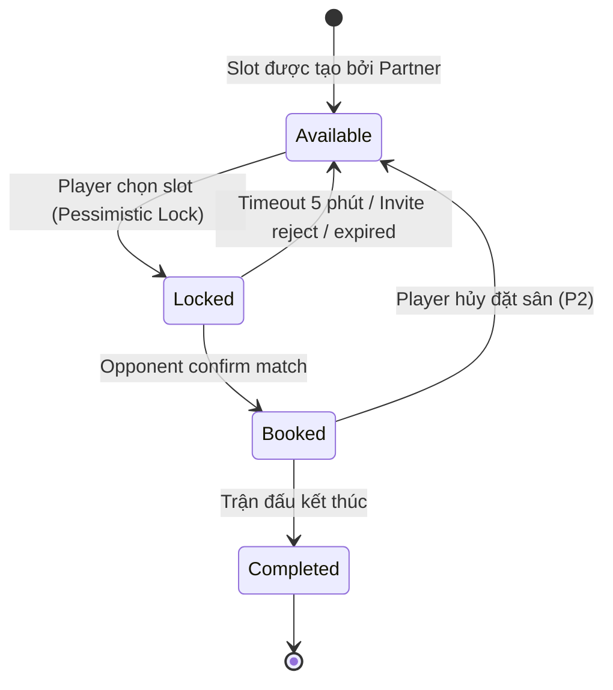
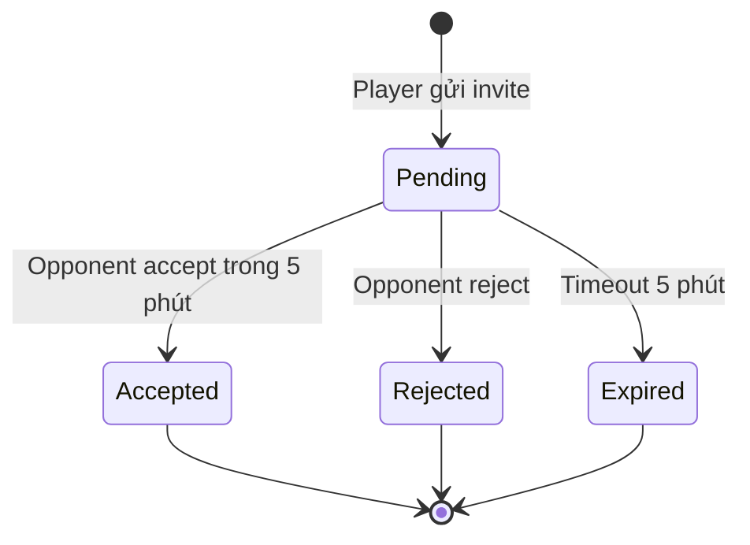
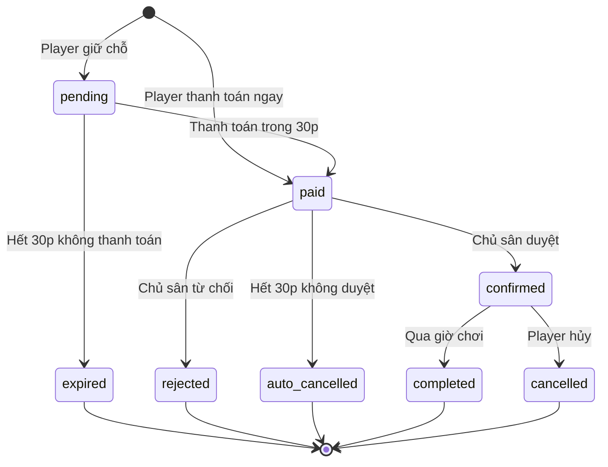
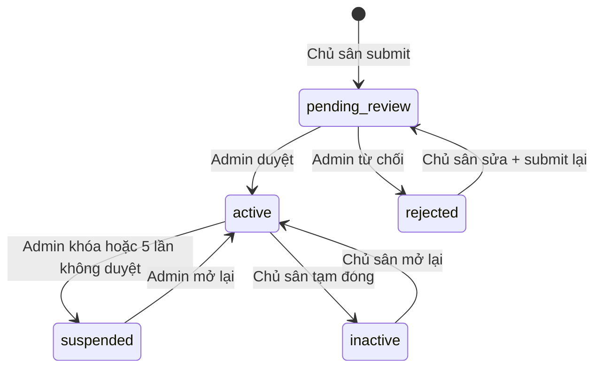

# Sport Matching — State Diagrams

## State: Match

| Từ | Sang | Trigger | Reversible |
|----|------|---------|------------|
| Created | WaitingConfirm | System gửi invite cho đối thủ | Không |
| WaitingConfirm | Confirmed | Đối thủ nhấn Accept | Không |
| WaitingConfirm | Expired | Timeout 5 phút không phản hồi | Không (tạo match mới) |
| WaitingConfirm | Rejected | Đối thủ nhấn Reject | Không (chọn đối thủ khác) |
| Confirmed | InProgress | Đến giờ trận đấu | Không |
| Confirmed | Cancelled | Player hủy trận (P2, max 3/tháng) | Không |
| InProgress | Completed | Trận kết thúc | Không |

## State: Slot

| Từ | Sang | Trigger | Reversible |
|----|------|---------|------------|
| Available | Locked | Player chọn sân + slot | Có (hết 5 phút) |
| Locked | Booked | Opponent accept match | Không (trừ hủy P2) |
| Locked | Available | Timeout 5 phút / reject / expired | Tự động |
| Booked | Completed | Trận đấu kết thúc | Không |
| Booked | Available | Player hủy (P2) | Slot quay về trống |

## State: Invite

| Từ | Sang | Trigger | Reversible |
|----|------|---------|------------|
| Pending | Accepted | Opponent nhấn Accept | Không |
| Pending | Rejected | Opponent nhấn Reject | Không |
| Pending | Expired | 5 phút không phản hồi | Không |

## State: Booking (Đặt sân)

| Từ | Sang | Trigger | Reversible |
|----|------|---------|------------|
| (mới) | pending | Player chọn Giữ chỗ | Không |
| (mới) | paid | Player thanh toán ngay | Không |
| pending | paid | Thanh toán trong 30p | Không |
| pending | expired | Hết 30p không thanh toán | Không |
| paid | confirmed | Chủ sân duyệt trong 30p | Không |
| paid | rejected | Chủ sân từ chối → hoàn tiền auto | Không |
| paid | auto_cancelled | Hết 30p chủ sân không duyệt → hoàn tiền | Không |
| confirmed | completed | Qua giờ chơi | Không |
| confirmed | cancelled | Player hủy (hoàn tiền theo chính sách) | Không |

## State: Venue (Sân)

| Từ | Sang | Trigger | Reversible |
|----|------|---------|------------|
| (mới) | pending_review | Chủ sân submit sân mới | Không |
| pending_review | active | Admin duyệt | Có (admin khóa) |
| pending_review | rejected | Admin từ chối + gửi lý do | Có (sửa + submit lại) |
| active | suspended | Admin khóa hoặc 5 lần không duyệt booking | Có (admin mở lại) |
| active | inactive | Chủ sân tạm đóng sân | Có (mở lại) |
