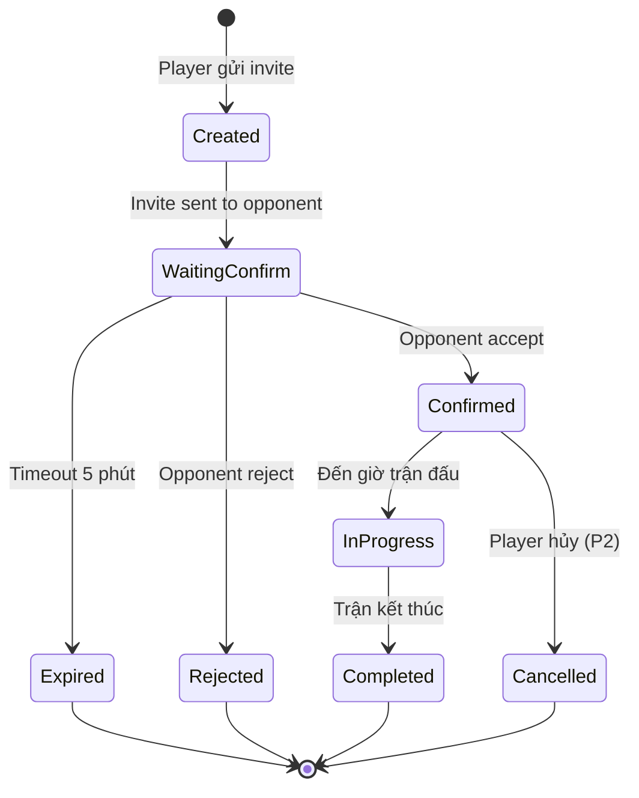
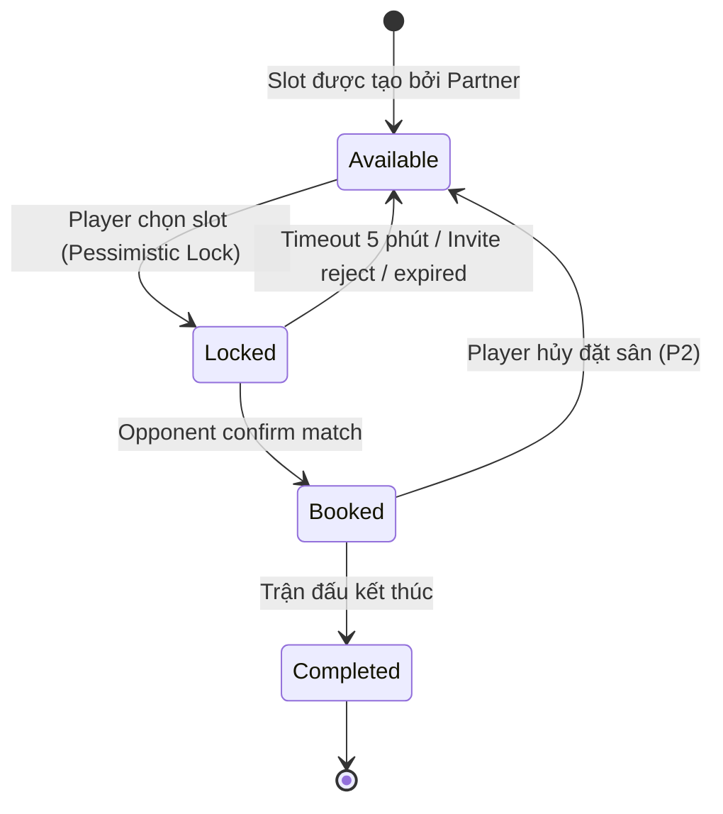
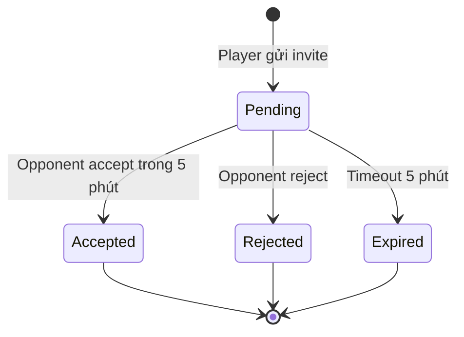

# Sport Matching — State Diagrams

## State: Match

| Từ | Sang | Trigger | Reversible |
|----|------|---------|------------|
| Created | WaitingConfirm | System gửi invite cho đối thủ | Không |
| WaitingConfirm | Confirmed | Đối thủ nhấn Accept | Không |
| WaitingConfirm | Expired | Timeout 5 phút không phản hồi | Không (tạo match mới) |
| WaitingConfirm | Rejected | Đối thủ nhấn Reject | Không (chọn đối thủ khác) |
| Confirmed | InProgress | Đến giờ trận đấu | Không |
| Confirmed | Cancelled | Player hủy trận (P2, max 3/tháng) | Không |
| InProgress | Completed | Trận kết thúc | Không |

## State: Slot

| Từ | Sang | Trigger | Reversible |
|----|------|---------|------------|
| Available | Locked | Player chọn sân + slot | Có (hết 5 phút) |
| Locked | Booked | Opponent accept match | Không (trừ hủy P2) |
| Locked | Available | Timeout 5 phút / reject / expired | Tự động |
| Booked | Completed | Trận đấu kết thúc | Không |
| Booked | Available | Player hủy (P2) | Slot quay về trống |

## State: Invite

| Từ | Sang | Trigger | Reversible |
|----|------|---------|------------|
| Pending | Accepted | Opponent nhấn Accept | Không |
| Pending | Rejected | Opponent nhấn Reject | Không |
| Pending | Expired | 5 phút không phản hồi | Không |
